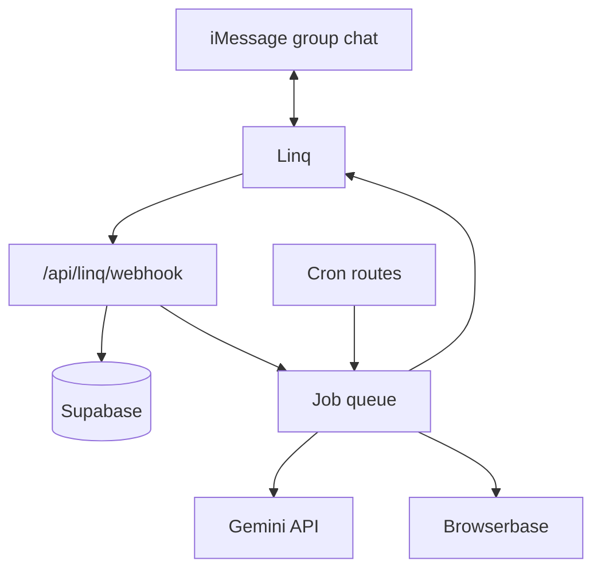

# Japlan - Build Plan

2026-09-19 · @Someone

## What Japlan is

Japlan is an AI agent that lives in an iMessage group chat and turns a vacation into a points game. Most trips die in the group chat, and the ones that survive turn into five people scrolling their phones in a hotel lobby. Japlan sits in the thread people already use, plans a loose itinerary from what they are already saying, splits the group into teams, and issues daily tasks worth points.

The core loop, once a trip is live:

1. Morning: the bot posts each team's task board and the day's itinerary anchors
2. During the day: people claim tasks by texting a code, a description, or a photo
3. Randomly: sidequests fire as DMs to individuals, first to complete wins
4. Evening: standings post, plus a rating prompt that reweights tomorrow
5. Last night: a Wrapped page summarizing the trip

### Three corrections to the original notes

**Linq does not score anything.** Linq is the transport layer that moves messages in and out of iMessage: send, receive, tapbacks, typing indicators, read receipts, group threads, media. Task difficulty scoring, point math, claim resolution, and itinerary planning all live in the Japlan backend. The original notes say "determined by Linq based on difficulty," which will send you looking for an endpoint that does not exist.

**Age needs care.** If anyone in a group chat is under 18, Japlan inherits data-handling obligations and a bot that assigns dares to minors. Collect an age bracket rather than an exact age, and gate the product to 18+ for v1.

**The photo bonus is the biggest exploit in the design.** Scoring photo difficulty 1-5 from the photo alone means a vision model judges how impressive the image looks, not how hard it was to get. Someone screenshots a professional shot of Fushimi Inari and scores a 5. The fix is in Scoring: declare the ceiling at task generation time, and score fidelity rather than quality.

## Architecture

The rule that governs everything: **the webhook never blocks.** Verify the signature, persist the raw event, return 200, hand off. LLM calls take seconds and Browserbase sessions take minutes, and Linq retries on timeout, which means duplicate point awards.



| Layer | Owns |
| --- | --- |
| Linq | Transport only: send, receive, tapbacks, typing, media, group threads |
| Next.js on Vercel | Webhook intake, cron jobs, async workers |
| Supabase | Postgres state plus storage for claim photos |
| Gemini API | Survey conversation, task generation, claim resolution, vision scoring |
| Foursquare Places | Coordinates, hours, category IDs, price band; batched at trip creation |
| Browserbase | Scraping what has no clean API, always off the request path |

Routes:

- `/api/linq/webhook` - verify, dedupe, 200 fast, enqueue
- `/api/jobs/*` - async workers that do the slow work
- `/api/cron/daily-board` - morning generation
- `/api/cron/reminders` - nudges and standings posts

Keep `lib/linq` and `lib/browserbase` as thin adapters with no game logic, and `lib/game` as pure logic with no network calls. Scoring is then unit-testable without a phone.

## Data model

Two keys carry the whole system. `trips.linq_chat_id` is how an inbound webhook finds the right game. `events.linq_event_id UNIQUE` is the idempotency guard: insert first, and if it conflicts, you have already seen this event, so drop it.

```sql
trips          id, linq_chat_id, name, destination, start_date, end_date,
               state, difficulty, stake_text, timezone

participants   id, trip_id, phone, display_name, score, survey_json,
               survey_state, sidequests_muted, consented_at

teams          id, trip_id, name, color, formed_at, dissolved_at

team_members   id, team_id, participant_id

places         id, trip_id, fsq_place_id, name, lat, lng, category, source,
               suggested_by, hours_json, price_band, score

itinerary      id, trip_id, day, anchor_order, place_id, planned_time

tasks          id, trip_id, participant_id, team_id, code, title, tier, axes_json,
               base_points, photo_bonus_max, verification, day,
               expires_at, neighborhood

claims         id, task_id, participant_id, evidence_url, image_hash,
               status, awarded_points, resolved_by, resolution_json

events         id, trip_id, linq_event_id UNIQUE, type, payload, processed_at

ratings        id, participant_id, place_id, score, created_at
```

Notes on the less obvious columns:

- `survey_state` tracks where a participant is in the branching DM survey, since it spans many messages
- `axes_json` stores the six raw axis values so you can re-derive points if you change the weights mid-development
- `image_hash` is a perceptual hash, not a file hash, so a re-crop still matches
- `resolution_json` keeps the model's reasoning for every claim, which is what you will read when someone disputes a score
- `participants.score` is the authoritative total. Teams have no score of their own, since a team task writes the full value to every member
- `teams` is time-bounded: a team exists from the moment the group splits until it reconverges or the day ends, which is what `formed_at` and `dissolved_at` record; membership lives in `team_members`
- `tasks` carries exactly one of `participant_id` or `team_id`, never both

## Scoring

**The LLM proposes axes, your code computes points.** Never let the model output a point value directly, or values inflate over a week as the conversation context grows.

Six axes, each 1-5:

| Axis | Weight | What it measures |
| --- | --- | --- |
| Boldness | 1.5 | Social friction, willingness to look silly |
| Physical | 1.3 | Effort, distance, stairs |
| Time | 1.3 | Wall clock: 1 is under 15 min, 5 is a half day |
| Scarcity | 1.2 | How rare or hard to find |
| Cultural relevance | 1.0 | How specific to this place |
| Aesthetics | 0.7 | How good it looks |

Boldness is weighted highest because social friction is what produces the stories people retell. Aesthetics is lowest because it is the most gameable.

Time was the missing axis in the original notes. The other five measure how hard, how rare, how bold, how pretty, how local, and none of them capture that a trivially easy task can still cost two hours of a five-day trip.

```latex
base = \mathrm{round}(1.5b + 1.3p + 1.3t + 1.2s + 1.0c + 0.7a)
```

Tier bands off the weighted total:

- Light: 1-10
- Medium: 11-20
- Challenging: 21-30

### Photo bonus, de-exploited

Declare `photo_bonus_max` at task generation time, not at claim time. The task already knows how hard a good photo of it would be. The vision model then scores only within that ceiling, and it scores **task fidelity** (does this photo show the thing that was asked) rather than photo quality.

Anti-gaming layer, in order of cost:

- Perceptual-hash every claim image and reject repeats across the whole trip
- Require an EXIF timestamp inside the trip window where present
- Where EXIF carries GPS and the task is location-bound, check it against the place
- No EXIF at all is suspicious, so cap the bonus at 1

This will not stop a determined cheater. It stops the lazy screenshot, which is most of it.

### Who holds the score

**Individuals are the unit of scoring.** Every participant has their own running total, and that is what the standings show. Teams are not a permanent structure, they are a thing that exists only when people actually split up for an afternoon.

When a team task completes, **every member of that team receives the full point value**, not a split. A four-person team completing a 20-point task means four people each gain 20. This is deliberate:

- It removes the incentive to hoard tasks or do them alone
- It makes joining a splinter group strictly better than not, which is the behaviour you want
- Split points would punish larger teams and make team size a scoring exploit

The cost is score inflation on team-heavy days, which is fine because everyone on the team inflates equally, and solo players are choosing a different tradeoff (fewer tasks, but no coordination overhead).

Teams form ad hoc: someone says the group is splitting, the bot asks who is with whom, and a team exists until the group reconverges or the day ends. Team membership is a time-bounded record, not a property of the participant.

Schema consequence: `tasks.team_id` becomes nullable and a task is assigned to either a participant or a team. `claims` awards to every member of the team at resolution time, so a team task produces N claim rows, one per member, each with the same `awarded_points`.

### Keeping it close

The failure mode is one team going up 200 points on day two and everyone else disengaging. Three levers:

- Catch-up bounties: the trailing team gets one exclusive high-value task per day
- Escalating values: later days are worth more, so day one is never decisive
- Final-day multiplier: day five tasks count double, which is a fudge everyone understands

Points only go up. No deductions for skipped tasks or slow days, because someone will be hungover or sick or just want a quiet afternoon, and a system that docks them makes the bot the villain. Unclaimed tasks simply expire. The one exception is the optional wager sidequest, where the team chose the risk.

## Claim resolution

Every task gets a two-character code (`A1`, `A2`) so there is always a cheap deterministic path. People can still claim in natural language, but the code is the fast lane.

Priority ladder, cheapest first:

1. Explicit code in the text - regex, no LLM, instant
2. Photo plus code in the same message, or within 60 seconds of one
3. Photo alone - vision-match against that team's open tasks, ask if two plausibly match
4. Text description alone - fuzzy match against open task titles
5. No confident match - **stay silent**

Step 5 is non-negotiable. Most photos in a trip group chat are not claims, and a bot that replies to every one gets muted on day two.

The bare-photo case needs a time window: if a photo lands within 60 seconds of a message mentioning a task, bind them. Otherwise treat it as an independent claim. Linq gives you the sender handle on inbound messages, so attribution never requires asking.

### Verification tiers

Tag each task at generation time:

| Tier | How it resolves | Use for |
| --- | --- | --- |
| Photo-verified | Vision model checks fidelity, auto-awards | Anything visual |
| Honor system | Any claim awards it | Tastes, feelings, unphotographable things |
| Peer-confirmed | Needs a tapback from the other team | Challenging tier, high-value tasks |

Peer-confirmed is both your cheating defense and a way to pull the other team into watching. Tapbacks arrive as webhook events, so it costs almost nothing to implement.

### Edge cases to settle

- Double claims on the same task: first write wins, tell the second person plainly
- Rejected vision match: say so once, softly, never twice for the same task
- **Retroactive claims are allowed.** Trip chats are asynchronous and people will say "we did A1 yesterday." The claim resolves against the task as it stood that day, at the points it was worth then, with no expiry penalty. The EXIF timestamp still has to fall inside the trip window.
- Reused photos: caught by the perceptual hash
- Team task claimed by one member: awards to every member of that team at resolution time

### Splitting up

A split is triggered conversationally, not by a command. Someone says the group is dividing, the bot confirms who is with whom, and teams exist until the group reconverges or the day ends.

```
Sarah: japlan me and jess are doing shimokita, boys are
       going to akihabara
```

The bot parses the split from the message where it can and asks only about people it could not place. It never makes anyone register for a team.

Team boards are generated per team from that point, along the route each team is actually taking. That is where the mechanic pays off: teams doing different tasks along a shared route, reconverging at the next anchor.

### Disengagement

One person dropping out around day two is the common case, and an unhandled one. The scoreboard showing them falling further behind is exactly the wrong feedback.

When a participant has claimed nothing for roughly a day and has not replied to a DM, the bot stops DMing them, keeps them on the standings without comment, and does not chase. If they claim something later, they resume as if nothing happened. No "welcome back", no catch-up offer, no mention of the gap.

The principle matches the rest of the scoring design: nothing about the system should make a quiet afternoon feel like a penalty.

## Tasks and sidequests

### Generation, in three layers

**Templates.** A hand-written bank of archetypes with slots: eat something starting with a letter range, photograph a subject before a time, get to a landmark without a transport mode, learn a phrase from a local. Twenty to thirty archetypes covers a week. Templates give you reliability, replayability, and verification metadata baked in.

**Localization.** Fill the slots from a destination profile assembled once at trip creation: real neighborhoods, transit lines, dishes, opening hours, a few genuinely weird landmarks. A model asked to name a Tokyo neighborhood cold says Shibuya every time. Handed twelve real ones with coordinates, it spreads out.

**Personalization.** One LLM call per team per morning. Inputs: destination profile, today's weather, the team's preference vector, tasks already completed, yesterday's ratings, the current score gap, and the template bank. Output is JSON with code, title, the six axes, verification tier, and neighborhood.

### Validation, in code, after generation

Reject any generated task that:

- Requires a booking or reservation
- Costs more than the lowest budget ceiling on that team
- Conflicts with a dietary, allergy, or mobility constraint of anyone on that team
- Is unsafe, illegal, or involves anything permanent
- Duplicates a completed task
- Cannot be done in the time window before it expires

Models will confidently generate "get a tattoo." You want a hard filter, not a vibe check.

### Sidequests

Structurally different from the daily board. The board is a menu you choose from; a sidequest is something that happens to you.

**Sidequests are entirely optional.** They are offered, never imposed. Ignoring one costs nothing, there is no penalty for letting it expire, and a participant can mute them for themselves at any time without leaving the game. The bot never chases an unanswered sidequest.

This constrains the subtypes below. Ambush becomes an offer to whoever happened to message, not a forced claim. Wager is opt-in by definition. Anything that takes points from someone who did not choose to play is out, which is most of the case against Steal.

The asymmetry from the original notes is the good part and should stay: **DM out, group announce in.** Individuals get the task privately, the winner is announced publicly. Nobody knows who else is racing.

Triggers, not schedule:

- Score gap crosses a threshold (offered to the trailing team only)
- A team idle for three or more hours
- Weather changes, especially rain starting
- Arrival at an itinerary anchor
- Someone completes a Challenging task
- Pure random, once or twice a day

Properties:

- Short fuse, 30 to 60 minutes, because urgency is the mechanic
- Low value, 5 to 15 points, so they never decide the game
- First-come, both teams eligible
- One live at a time, ever
- Skewed high on boldness, low on time cost

Subtypes worth building:

| Subtype | How it works |
| --- | --- |
| Ambush | Offered to whoever next messages in the chat, declinable |
| Duel | Same task to several people, faster claim takes it |
| Wager | Trailing player only, double or nothing, opt-in |
| Chain | Completing one unlocks a harder one, up to three deep |

Steal does not ship. Taking points from someone who may have opted out of sidequests entirely is the one mechanic that reliably makes people angry, and optional sidequests remove what little justification it had.

**Sidequests queue, never interrupt.** If a participant has an in-progress task, a triggered sidequest waits until that task resolves or expires, then fires with a fresh fuse. One queued at a time, and the queue drops anything older than the day. Interrupting is funnier in the abstract and annoying in practice, especially for someone mid-way through a Challenging task who now has two clocks running.

Every subtype above is declinable. A sidequest that expires unclaimed is a non-event, never a penalty.

## Itinerary planning

Three input pools, in order of signal quality:

1. **Chat extraction.** Named places, URLs, and social links people already dropped in the thread over weeks of planning. "We HAVE to go here" is the highest-signal data you will ever get, and it is already sitting there. This is also the most defensible use of chat-reading, since it turns noise the group already made into something useful.
2. **Survey recommendations.** Asked directly during the DM survey.
3. **Real place data.** From the Foursquare Places API: coordinates, hours, category IDs, and price band, filtered by the survey's interest buckets mapped to Foursquare category IDs.

Then solve it as routing, not creativity:

- **Cluster by neighborhood** so a day is walkable. This is the single biggest quality lever, and models are bad at it without coordinates in the prompt.
- **Hard-filter hours and closure days in code**, never in the prompt. Half the Tokyo museum problem is Monday closures.
- **Anchors per day from the pace setting**: three for a relaxed group, five or six for a chaotic one.
- **Coverage**: every person sees at least one thing they explicitly flagged, or they will notice.
- **Leave gaps deliberately.** The empty space between anchors is where the tasks live.

The key structural idea: the task board is generated *from* the day's route. Anchors are the itinerary, tasks fill the travel time and dead hours between them, and a task like "get from Senso-ji to Ueno without a train" is a challenge and a transit leg at once. When teams split up they are doing different tasks along a shared route, reconverging at the next anchor.

Tomorrow is always provisional until the night before. That is what makes last-minute changes work: you are not editing a fixed plan, you are regenerating from an updated preference vector.

After each anchor, prompt for a rating. A thumbs down on a temple lowers the weight on religious sites for the rest of the trip. Ratings feed preferences only, never points, or people will spam them.

### Last-minute changes

Re-planning is regeneration, not editing. When a constraint moves (the group wakes up late, it starts raining, someone is sick), the day is rebuilt from the updated constraints and the unchanged anchors happen to survive.

The hours filter is code, so a dropped anchor is a fact rather than a judgement call: shifting a start time from 9am to 2pm removes a morning-only market automatically. The bot states what dropped and why in one line, and does not negotiate.

Only the current day and later are regenerated. Completed anchors and resolved claims are immutable, which is what makes retroactive claims safe.

### Ratings

Fired after each anchor, tapback-only so nobody has to type. A thumbs down on a temple lowers the weight on religious sites for the rest of the trip and reshuffles tomorrow's unconfirmed candidates.

Ratings feed preference weights only and never award points. Attach points and people spam them.

Ratings on an anchor also feed task generation, not just the itinerary: a group that dislikes museums should stop getting museum-adjacent tasks too.

### Foursquare as the places layer

All structured place data comes from the Foursquare Places API. Base URL `https://places-api.foursquare.com`, search at `GET /places/search`.

Auth is a **Service Key**, the method intended for userless interfaces, scripts, and background processes, passed as `Authorization: Bearer <key>`. A second header is mandatory: `X-Places-Api-Version: 2025-06-17`, which pins the response shape to a dated version so a future change does not silently break parsing.

Ignore any tutorial using `api.foursquare.com/v3` with a bare `Authorization: 12345` header. That is the legacy V3 API, deprecated May 15, 2026, and Foursquare's own docs still show both side by side.

Two constraints that shape the design:

- **Call budget.** The free Pro allowance dropped to 500 calls a month on June 1, 2026. One trip's destination profile can eat a meaningful chunk of that. Batch all searches at trip creation, cache into the `places` table, and never call Foursquare from the webhook path.
- **Storage terms.** The standard Places license restricts storing, merging, or redistributing data outside the application, which is in tension with caching a profile for five days. Read the terms on the actual plan before building the cache layer. If storage is restricted, use Foursquare Open Places (flat quotas, results can be stored) for the cacheable bulk layer and Pro only for live lookups.

The payoff is the taxonomy: over 1,500 stable category IDs. Map the survey's interest buckets to category ID sets once in a constants file, and preference weighting becomes a filter rather than a prompt. Store the venue id on every row in `places` so a specific venue can be re-fetched later. The field is `fsq_place_id`, not `fsq_id`, confirmed against a live response.

### Scope for v1

Full cold-start itinerary generation is a v2 feature. For v1 the bot:

1. Extracts and dedupes places mentioned in the chat
2. Resolves them against Foursquare for coordinates, hours, and categories
3. Clusters by neighborhood
4. Proposes which cluster belongs to which day
5. Lets the group confirm or rearrange

That is most of the value, leans on the input pool with the best signal, and removes nearly all dependence on scraped hours. Nobody adds a bot to a group chat for itinerary optimization, which maps apps already half-do. They add it for the dares.

## Onboarding survey

Run in DM, one question per message, so it reads like texting rather than a form. Four to eight questions per person, with "skip" always allowed. A fixed twenty-question form gets abandoned around question six.

### Hard constraints, asked of everyone

These break the trip if you get them wrong, and they are filters rather than weights:

- Dietary restrictions and allergies (allergy is a safety constraint, never a soft weight)
- Mobility and physical limits
- Budget ceiling per day, and for the trip
- Blackout times: work calls, prayer, a nap they will defend
- Age bracket, for the 18+ gate

### Preference weights

- **Interest allocation.** Give a fixed pool of points to distribute across food, nature, museums, nightlife, shopping, architecture, local weird stuff. The categories have to work for any destination, not one country. Forced tradeoff beats rating each 1-5, because everyone rates everything a 4.
- **Pace.** Up at 7 and moving, versus two things and a long lunch.
- **Chaos tolerance.** Unique to Japlan. Determines whether they get social-friction tasks at all.
- **Competitiveness.** Some want to win, some want to be dragged along. Feeds team balancing.
- **Attraction recommendations.** Their own list, which feeds the itinerary pool.

### Social graph

Asked privately, never revealed:

- Who would you like to be with if the group splits up for an afternoon?
- Who have you already travelled with a lot? (the gentle phrasing of the inverse)
- Couples: split or keep together, asked rather than assumed

This one question set makes team assignment dramatically better than random.

### Group level, asked once to whoever set it up

Destination and dates if not inferable from the chat, arrival and departure times, team sizes and counts, task difficulty, and the stake for last place.

The stake should come from the group, not the bot. The bot asks "what is the loser doing?", holds the answer, and surfaces it at the end. A bot enforcing a stake the group invented is funny. A bot inventing the stake is presumptuous.

### Branching

Open with four or five questions, then let answers open doors:

| If they answer | Then ask |
| --- | --- |
| High chaos tolerance | Which dare categories: strangers, public singing, unidentifiable food |
| Low chaos tolerance | Skip that branch entirely, ask what they would rather do |
| Food-heavy allocation | Spice tolerance, street food, adventurousness |
| Nightlife points | Drinking, since a large slice of the task bank depends on it |
| Any dietary restriction | How strict: allergy, preference, or "I will cheat on vacation" |
| Low budget | Skip every paid-attraction question, weight free tasks up |

Re-survey briefly on day three. What people said they wanted before the trip and what they actually enjoyed on day two are different datasets, and the second is better.

### The rule that matters most

**Everything collected in DM stays in DM.** If the bot ever says "Michael's budget is low" in the group chat, you have built a machine for creating awkwardness. Enforce it at the prompt level and write a deliberate test for it.

### Split the survey in two

Six questions is already near the abandonment threshold, and the current design asks all of them before the bot has done anything useful. Someone just got added to a group chat by a friend and is immediately asked about allergies, budget, and who they want to be teamed with.

Better: ask only the hard constraints at setup (dietary, mobility, budget ceiling, age bracket), then ask the preference questions on day one once the bot has posted a board and earned some trust. Two short conversations instead of one long one, and the day-one answers are better because the person now knows what they are answering for.

`survey_state` already supports this, since it tracks position across many messages. The change is a second survey phase, not a second mechanism.

## Gemini integration

Japlan runs on the Gemini API. Rates below are the standard paid tier as of September 2026, per million tokens, and should be re-checked against [Google's pricing page](https://ai.google.dev/gemini-api/docs/pricing) before budgeting.

| Model | Input | Output |
| --- | --- | --- |
| Gemini 3.1 Pro (up to 200K) | $2.00 | $12.00 |
| Gemini 3.6 Flash | $1.50 | $7.50 |
| Gemini 3.5 Flash-Lite | $0.30 | $2.50 |
| Gemini 2.5 Flash-Lite | $0.10 | $0.40 |

### Routing per call site

Route most traffic to the cheapest model that clears the quality bar, and escalate only the hard cases.

| Call site | Model | Why |
| --- | --- | --- |
| Claim resolution, text | Flash-Lite | Highest volume, simplest judgment, latency matters |
| Claim resolution, vision | Flash-Lite | Volume driver; validate fidelity scoring first |
| Survey conversation | Flash | Tone matters, low volume |
| Task generation | Flash | Twice a day, structured output, worth the quality |
| Itinerary planning | Flash or Pro | Runs once per trip, so cost is irrelevant here |

### Cost per trip

Rough model for a five-person, five-day trip: roughly 1M input tokens and 100K output across surveys, \~300 inbound messages, \~60 photo claims, 10 board generations, and itinerary planning.

| Routing | Estimated cost per trip |
| --- | --- |
| Everything on 2.5 Flash-Lite | \~$0.14 |
| Everything on 3.5 Flash-Lite | \~$0.55 |
| Mixed (Flash-Lite volume, Flash generation) | \~$1 |
| Everything on 3.6 Flash | \~$2.25 |

So roughly a dollar a trip. Cost is not a constraint on this product at any plausible early scale, which means optimize for quality and latency rather than price.

### Three meters that inflate the bill

- **Thinking tokens bill at the output rate**, even when the visible answer is short. Claim resolution should run with the thinking budget tuned down, since it is a classification task, not a reasoning one.
- **Flash rates double on January 1, 2027.** The current 3.6, 3.7 and 3.8 Flash rates are promotional through the end of 2026. Budget against the post-January number if this runs into next year.
- **Context caching has two meters.** Cache reads are a tenth of fresh input, but storage bills per million tokens per hour. A cache written and rarely read is a net loss. The destination profile is the one good caching candidate here, since it is read many times a day during a trip.

The free tier through AI Studio covers Flash and Flash-Lite and is plenty for building steps 1 to 4. Move to paid before any real trip, since free-tier data may be used to improve Google's products.

### Structured output

Task generation must return parseable JSON or there is no board that morning. Use a response schema rather than prompting for JSON and hoping:

```ts
const res = await model.generateContent({
  contents: [{ role: "user", parts: [{ text: prompt }] }],
  generationConfig: {
    responseMimeType: "application/json",
    responseSchema: {
      type: "array",
      items: {
        type: "object",
        properties: {
          code: { type: "string" },
          title: { type: "string" },
          axes: {
            type: "object",
            properties: {
              boldness: { type: "integer" },
              physical: { type: "integer" },
              time: { type: "integer" },
              scarcity: { type: "integer" },
              cultural: { type: "integer" },
              aesthetics: { type: "integer" },
            },
            required: ["boldness", "physical", "time", "scarcity", "cultural", "aesthetics"],
          },
          verification: { type: "string", enum: ["photo", "honor", "peer"] },
          photo_bonus_max: { type: "integer" },
          neighborhood: { type: "string" },
        },
        required: ["code", "title", "axes", "verification", "photo_bonus_max"],
      },
    },
  },
});
```

The schema returns axes, never points. Points are computed in `lib/game/scoring.ts` from the weights table above.

### Vision claims

Inline base64 for anything small, the Files API for larger images. The prompt asks for fidelity against the task text, bounded by the task's declared ceiling:

```ts
contents: [{
  role: "user",
  parts: [
    { inlineData: { mimeType: "image/jpeg", data: base64 } },
    { text: `Task: "${task.title}". Does this photo show it? Score fidelity 0-${task.photo_bonus_max}.` },
  ],
}]
```

**Calibrate before trusting it.** Build a fixture set of about 20 labeled photos and check the score distribution. Models cluster differently: one may never give a 5, another never below 3. Recalibrate whenever you change model tier.

### Keep the adapter anyway

Even committed to Gemini, put every call behind one interface with a `"fast" | "smart"` tier indirection rather than model names scattered across files. Model names change every few months, the Flash rate doubles in January, and you will want to move call sites between tiers as you learn what each needs.

```ts
// lib/llm/index.ts
export interface LLMProvider {
  complete(opts: {
    system: string;
    messages: Msg[];
    schema?: object;
    images?: { data: string; mime: string }[];
    tier: "fast" | "smart";
    thinkingBudget?: number;
  }): Promise<string>;
}
```

Gemini env: `GEMINI_API_KEY`, `GEMINI_FAST_MODEL`, `GEMINI_SMART_MODEL`.

### All environment variables

Every key lives in `.env.local`, which must be gitignored before the first commit, with a valueless `.env.example` committed alongside it. On Vercel, the same keys go in Project Settings, Environment Variables.

| Variable | Where it comes from |
| --- | --- |
| `LINQ_API_KEY` | Linq Developer Dashboard, API, Overview, Generate new token |
| `LINQ_FROM_NUMBER` | The sandbox test number, E.164 format |
| `LINQ_WEBHOOK_SECRET` | Generated when the webhook subscription is registered |
| `GEMINI_API_KEY` | Google AI Studio |
| `GEMINI_FAST_MODEL` | Model string for the Flash-Lite tier |
| `GEMINI_SMART_MODEL` | Model string for the Flash tier |
| `FOURSQUARE_API_KEY` | Developer Console, API Keys, Service Key (copy at creation, shown once) |
| `FOURSQUARE_API_VERSION` | The pinned dated version, currently `2025-06-17` |
| `BROWSERBASE_API_KEY` | Browserbase settings |
| `BROWSERBASE_PROJECT_ID` | Browserbase settings |
| `SUPABASE_URL` | Supabase project settings, API |
| `SUPABASE_SERVICE_ROLE_KEY` | Same page; server-side only, never exposed to a client |
| `JAPLAN_WAKE_KEYWORD` | `japlan`, kept configurable for testing |

## Browserbase

Three concrete jobs, all off the request path:

Browserbase is a targeted supplement, not the primary place-data source. Foursquare covers coordinates, categories, hours, and price bands; Browserbase covers what no API can see:

1. **Social link resolution.** TikTok and Instagram place tags people drop in the chat. Nothing else can reach them, and they feed the chat-extraction pool, which is the highest-signal itinerary input.
2. **Hours verification for anchors only.** Called on the 10-15 places that actually make the itinerary, and only when the Foursquare hours look suspect or the venue is unusual. Not a bulk job.
3. **Destination profile mining.** Local blogs and aggregators, once per trip at creation, cached. Feeds the localization layer of task generation, not the itinerary.

Everything here runs as a batch job at trip creation or in a queued worker. A Browserbase session takes seconds to minutes, so it can never sit on the webhook path or inside a regeneration that needs to feel immediate.

Session hygiene, since sessions cost money and count against concurrency:

```ts
import { chromium } from "playwright-core";
import Browserbase from "@browserbasehq/sdk";

const bb = new Browserbase({ apiKey: process.env.BROWSERBASE_API_KEY! });

export async function withPage<T>(fn: (page: any) => Promise<T>): Promise<T> {
  const session = await bb.sessions.create({
    projectId: process.env.BROWSERBASE_PROJECT_ID!,
    browserSettings: { blockAds: true },
  });
  const browser = await chromium.connectOverCDP(session.connectUrl);
  // default context so the session records properly
  const page = browser.contexts()[0].pages()[0];
  try {
    return await fn(page);
  } finally {
    await browser.close();
  }
}
```

Always close in a `finally`. Orphaned sessions are the most common way to burn quota on this platform.

What Browserbase is explicitly **not** doing in v1: booking accommodations. That was in the original notes and it is a much heavier lift, involving payment handling, cancellation liability, and an agent spending real money based on chat inference. Park it until the free version works.

Also not in v1: bulk hours scraping. It was tempting, but scraping gets you the page and the parsing is still the hard part, and a confidently wrong closure day is worse than no data because the group shows up.

## Message formats

Every string the bot sends lives in `lib/game/copy.ts` as a constant or template, never inline in logic. The wording is product design and gets edited by hand; generated copy reads like a form.

House style: lowercase and conversational, no emoji except the status glyphs below, no exclamation marks, never more than one message where one will do.

### The daily board

```
Day 3 · Asakusa → Ueno · 18°C, rain after 4pm

⚓ 10:00 Senso-ji
⚓ 14:00 Ueno Park
⚓ 19:00 Ameyoko

C1 · eat something starting with A-D in Ameyoko (15)
C2 · find a vending machine drink nobody recognizes (20)
C3 · get from Senso-ji to Ueno without a train (30)
C4 · learn one phrase from a stranger, use it wrong (25)

Michael 140 · Sarah 135 · Dev 110 · Jess 95 · Aidan 95
```

The code letter is the day: A is day 1, B is day 2. That keeps a retroactive claim legible on day five. Digits are the task index within the day, one or two of them, so a board can exceed nine tasks.

Weather is in the header because it should already have shifted generation. A rain-heavy afternoon produces an indoor-weighted board, not an outdoor board with a warning attached.

### Claim confirmation

One line, always. The running total is the last element so the eye lands on it.

```
✅ C2 · Michael +20 · 160
✅ C2 · Michael +20 +2 photo · 162
```

No commentary, no congratulation, no restating the task. The bot is a scorekeeper.

### Peer confirmation

```
Dev claims C3 (no train, Senso-ji → Ueno).
👍 this if you believe him.
```

Resolves on the tapback event from anyone who is not the claimant.

### Splitting up

Triggered by someone saying so, not by a command. The bot confirms the shape rather than asking people to register.

```
got it. two groups till dinner.

Sarah + Jess · D5, D6
Michael + Dev + Aidan · D7, D8

team tasks pay full points to everyone on the team.
```

That last line is stated once per split, because the full-points rule is unintuitive and it changes how people behave.

### Ratings

Fired after an anchor. Tapback-only, no typing required.

```
Senso-ji, worth it?
👍 / 👎
```

The response is at most one short line, and never a score: `noted. fewer temples.`

### Sidequests

DM out:

```
sidequest, 30 min. first only.
order something by pointing, no english. 10 pts.
ignore this if you're not up for it.
```

Group announce in, only on a win. A sidequest nobody took is never mentioned again.

```
Dev took the sidequest. +10 · 150
```

### End of day

The better storytelling moment than the morning board, and currently the weakest-specified message. It should recap what people actually did, not just print standings.

```
day 3 done.

Dev crossed Asakusa on a rented bike (C3, 30)
Sarah found a drink none of you could read (C2, 20)
nobody touched C4.

Michael 160 · Sarah 155 · Dev 150 · Jess 95 · Aidan 95

C4 rolls over to tomorrow, worth 30 now.
```

### Last-minute changes

The bot re-plans rather than negotiating. Hours filtering is code, so a dropped anchor is a fact, not an opinion.

```
fair. Day 4 starts at 2pm now.
dropped Tsukiji (it's a morning thing).
Hama-rikyu moved to 2:30, Ginza after.
new board coming at 1.
```

### Itinerary proposal

Attribution matters here: naming who suggested a place is what makes the plan feel like the group's rather than the bot's. Unresolved candidates are surfaced, never silently dropped, and an empty day is stated honestly rather than padded.

```
here's a shape for the week. nothing's locked.

Day 1 · Asakusa + Ueno
  Senso-ji
  Ameyoko
  + the izakaya Dev linked

Day 3 · open
  I've got nothing clustered here yet

3 places didn't resolve: "that cat cafe emma sent",
"the vending machine place", "kenji's ramen rec".
want me to guess, or will someone paste links?

swap anything, or say go.
```

## Wrapped

Almost free if you instrument from day one, so log location, timestamp, participant, task, points and photo on every claim in step 2 rather than retrofitting it. Retrofitting means a trip's data is already gone.

### Build it against fixtures

**Wrapped must render from seed data before it renders from the database.** A page that only works after a real five-day trip cannot be built, tested, or shown until a real five-day trip exists. Ship `fixtures/wrapped-demo.json` matching the contract below on day one, build the entire page against it, and swap to a live aggregation query at the end.

That also makes Wrapped fully parallelizable with the bot, which is the main reason to freeze the contract early.

### The data contract

```ts
type WrappedData = {
  trip: {
    name: string;
    destination: string;
    startDate: string;
    endDate: string;
    days: number;
  };
  stats: {
    distanceKm: number;
    tasksClaimed: number;
    photosPosted: number;
    neighborhoods: string[];
    sidequestsClaimed: number;
  };
  route: {
    lat: number;
    lng: number;
    label: string;
    day: number;
    timestamp: string;
  }[];
  photos: {
    url: string;
    taskTitle: string;
    participant: string;
    awarded: number;
  }[];
  standings: { name: string; score: number; rank: number }[];
  superlatives: {
    label: string;
    value: string;
    detail?: string;
    photoUrl?: string;
  }[];
  stake: string | null;
  perPerson: Record<string, {
    score: number;
    rank: number;
    tasksClaimed: number;
    favoriteCategory: string;
    longestStreak: number;
    personalSuperlatives: { label: string; value: string }[];
  }>;
};
```

### Page structure

A vertical scroll of full-viewport cards, one claim per card, animating in. Not a dashboard: each screen makes exactly one point.

| # | Card | Content |
| --- | --- | --- |
| 1 | Cover | Trip name, destination, dates |
| 2 | The numbers | Distance, tasks, photos, neighborhoods |
| 3 | The map | Route drawn from claim coordinates, animated |
| 4 | Photo wall | Every claimed photo, grid |
| 5 | Standings | Final scores, animated count-up |
| 6 | Superlatives | One card each, five or six of them |
| 7 | The stake | What the group agreed the loser does |
| 8 | Share | Screenshot-sized card plus copy link |

Card 3 is the strongest visual and the cheapest to build well: claims carry coordinates and timestamps, so the actual path through the city is a polyline over a map.

### Superlatives beat totals

Totals are forgettable. These are what get screenshotted, so compute five or six and give each its own card with one large number and one line of text:

- Longest gap between two claims
- The task nobody completed
- Most sidequests claimed after midnight
- Most-rejected photo, with the photo
- Biggest single-day comeback
- Fastest claim after a board dropped
- The one person who never took a sidequest

### Group and personal views

One page, two sections. Group cards first, then a personalized section keyed off a participant id in the query string.

```
/w/<trip-slug>              group view
/w/<trip-slug>?p=<person>   group view plus your section
```

Each person gets their own link on the last night. The personal section is where sharing actually comes from, since people share things about themselves.

Render as a shareable page and drop the link in the group chat on the last night. This is also the only real growth loop: a Wrapped page shared outside the group is how the next group hears about Japlan.

## Build order

Strictly sequential. Each milestone is testable before the next exists.

| # | Milestone | Done when |
| --- | --- | --- |
| 1 | Repo, env, deploy skeleton | Vercel serves a publicly reachable webhook URL |
| 2 | Linq round trip | Signature verified, events deduped, every payload shape logged from a real group chat |
| 3 | Trip bootstrap | Bot detects being added, DMs everyone, completes the branching survey |
| 4 | Manual task board | Ten hand-written tasks, claims resolving end to end, scoring unit-tested |
| 5 | Task generation | LLM proposes axes, code computes points, validation rejects bad output |
| 6 | Itinerary | Chat extraction, place data, clustering, anchors with gaps |
| 7 | Sidequests | Triggers firing, DM out and group announce in |
| 8 | Wrapped | Shareable page from the instrumentation added in step 2 |

**Steps 1 to 4 are the real milestone.** If a group tolerates the bot for two days with hand-written tasks, the idea works. If they mute it, no amount of generation quality saves you.

Do step 2 in an actual group chat with two friends on day one. Group payload shape is the entire premise, and you want to see it before building the scoring engine on assumptions about it.

### Non-obvious things to get right early

- **Webhook idempotency** before any scoring exists, or a network retry awards the same task twice
- **Browserbase off the webhook path**, always, since sessions take minutes
- **Instrument for Wrapped in step 2**, because retrofitting location logging means a trip's data is gone
- **Channel abstraction** even though v1 is iOS-only: one `channel` field, all Linq calls behind one adapter, so adding RCS or WhatsApp later is a change in one module
- **Addressing gate first**, before any claim logic: the keyword check and the silent-by-default path are cheaper to build correctly than to retrofit onto a chatty bot

### Parallelizing across a team

The critical path is the bot: Linq, webhook, claim resolution, scoring. Everything else can proceed independently once the schema and the `WrappedData` contract are frozen.

| Track | Owns | Blocked by |
| --- | --- | --- |
| Bot core | Linq adapter, webhook, addressing, claims, scoring | Nothing after milestone 2 |
| Generation | Gemini task generation, template bank, survey copy | Schema only |
| Wrapped | The full page, against fixtures | The data contract only |
| Itinerary | Foursquare resolution, clustering, proposal formatting | Schema only |

Wrapped finishes first because fixtures unblock it completely. When it does, that track picks up itinerary proposal formatting, which is similarly self-contained.

The two things that must be hand-written rather than generated, by whoever owns them:

- **Survey question text.** The whole premise is that it feels like texting, and that is carried entirely by wording.
- **The task template bank.** Twenty to thirty archetypes. A model asked to invent them produces generic filler; a model filling slots in good templates produces your voice at scale.

## Open decisions

Settled, and binding on everything above:

| Decision | Resolution |
| --- | --- |
| Scoring unit | Individuals by default; teams only when the group actually splits up |
| Team task points | Every member gets the full value, never a split |
| When the bot speaks | Only when addressed by keyword, or in clear task context |
| Retroactive claims | Allowed, at the points the task was worth that day |
| Sidequests | Entirely optional, no penalty for ignoring them |
| Destination scope | Not Japan-only. The name is a working name, the system is general |
| Platform | iOS and iMessage only for v1 |

### Addressing: when the bot speaks

The wake keyword is `japlan`, matched case-insensitively anywhere in the message. It is the product name, so nobody has to remember a second thing, and it is vanishingly unlikely to appear in ordinary trip chatter. Reserve a short alias (`jp`) only if testing shows the full word is tedious, since `jp` collides with initials and airport codes.

The bot stays quiet unless one of these is true:

- The message contains japlan, case-insensitive
- The message is a DM to the bot
- The message contains a task code, which is unambiguous by construction
- The message arrives inside an open task context the bot is already tracking

Everything else is ignored, silently, including photos with no plausible claim match. This is the conservative reading of chat access and it makes the privacy story easy to state in the intro: the bot reads the thread to find claims and place mentions, and it only replies when spoken to.

One tension worth naming: passive itinerary extraction, pulling places out of weeks of chat backlog, sits awkwardly against a bot that only listens when addressed. Resolve it by making extraction an explicit, announced, one-time action during setup rather than a standing background behaviour.

### iOS only

No RCS or SMS fallback in v1, which simplifies a lot. Tapbacks, read receipts, and media are all guaranteed, so peer-confirmation by tapback and photo claims can be load-bearing rather than progressive enhancement.

The cost is that a group with one Android user cannot play, which is a real adoption ceiling and the most likely reason a specific group bounces. Keep the `channel` field and the Linq adapter boundary anyway, so adding RCS later is a change in one module rather than a rewrite.

### Destination scope

Japlan is general from v1, not Japan-scoped. That makes the destination profile a build-time pipeline rather than a hand-curated dataset: place data, hours, and neighborhood clustering all have to work for an arbitrary city. Budget for that in step 6, and expect the first non-Japan trip to expose gaps in the template bank's localization slots.

### Still open

Nothing blocking. Two to revisit after the first real trip: whether the trailing-player bounty should trigger per person now that individuals are the scoring unit, and whether the addressing gate turns out too strict in practice.

## Sources

- [Linq: iMessage for Agents](https://linqapp.com/blog/imessage-for-agents) - webhook setup, signature verification, payload versioning, typing indicators
- [Linq iMessage API](https://linqapp.com/imessage-api) - group chat, tapback, RCS and SMS fallback support
- [Browserbase Node SDK](https://docs.browserbase.com/reference/sdk/nodejs) - session creation and CDP connection pattern
- [Gemini Developer API pricing](https://ai.google.dev/gemini-api/docs/pricing) - current per-model rates
- [Gemini API pricing breakdown, Sep 2026](https://benchlm.ai/google/api-pricing) - tier comparison and long-context thresholds
- [Gemini pricing and cost control](https://www.getmaxim.ai/articles/gemini-api-pricing-in-2026-and-how-to-cut-what-you-pay/) - thinking tokens, caching meters, January 2027 rate change

* [Foursquare Places authentication](https://docs.foursquare.com/fsq-developers-users/reference/authentication) - Service Keys, bearer header, version header
